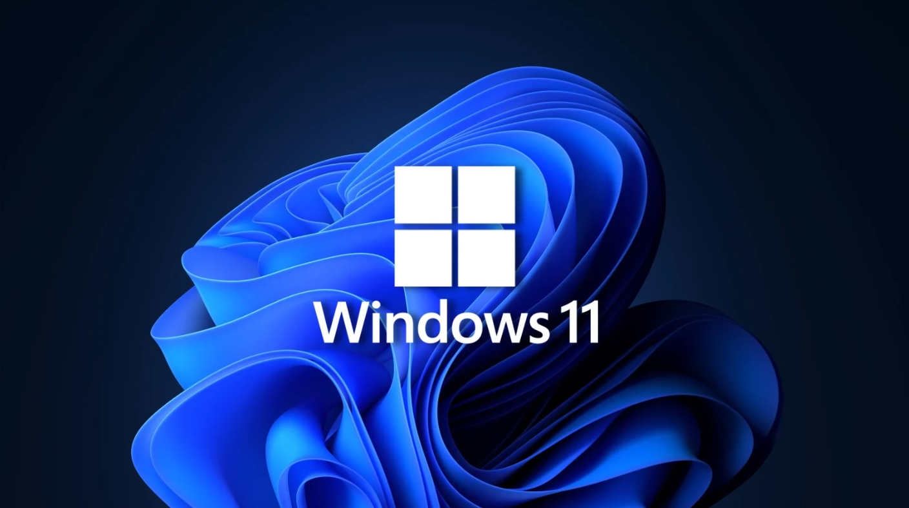

# Windows 11 Setup for Cyber Security and DevOps

This repository provides a complete guide and automation scripts for setting up Windows 11 for Cyber Security and DevOps tasks. Whether you’re a pentester, developer, or security researcher, this project will help you get your environment up and running quickly.



## How to Use

1. **Guides**: Step-by-step instructions on setting up different tools and environments.
2. **Scripts**: Automation scripts for setting up everything in one go.

### Available Guides

- [WSL2 Setup](Guides/WSL2_Setup.md)
- [PowerShell Setup](Guides/PowerShell_Setup.md)
- [Virtualization Tools Setup](Guides/Virtualization_Setup.md)
- [Cyber Security Tools Setup](Guides/CyberSec_Tools.md)
- [DevOps Tools Setup](Guides/DevOps_Tools.md)

### Available Scripts

Run the following PowerShell scripts to automate the setup process.

#### Install All Tools

This script installs essential tools for Cyber Security and DevOps.

```powershell
.\Scripts\install_all_tools.ps1
```

**Instructions:**

1. Open PowerShell as an Administrator.
2. Navigate to the directory where the script is located.
3. Run the script using the command above.

#### Install WSL2 and Related Tools

This script installs WSL2 and key Cyber Security tools.

```powershell
.\Scripts\install_wsl2_and_tools.ps1
```

**Instructions:**

1. Open PowerShell as an Administrator.
2. Navigate to the directory where the script is located.
3. Run the script using the command above.

## Essential Cyber Security Tools Links

Check out the download [links](Tools/Links.md) for download

## Additional Information

- Ensure that Windows Package Manager (`winget`) is installed and up to date before running the scripts.
- The scripts may prompt for administrative permissions during installations.
- Monitor the installation process for any errors.

## Contributing

We welcome contributions to this project! If you'd like to contribute, please follow our [Contributing Guidelines](CONTRIBUTING.md) for instructions on how to get started.

### Ways to Contribute

- **Report Bugs**: If you find any bugs or issues, please open an issue.
- **Suggest Features**: We welcome suggestions for new features or improvements.
- **Submit Pull Requests**: Feel free to fork the repository, make changes, and submit a pull request!

Your contributions help make this project better for everyone. Thank you for your support!

## License

This project is licensed under the MIT License. See the [LICENSE](LICENSE) file for more details.
